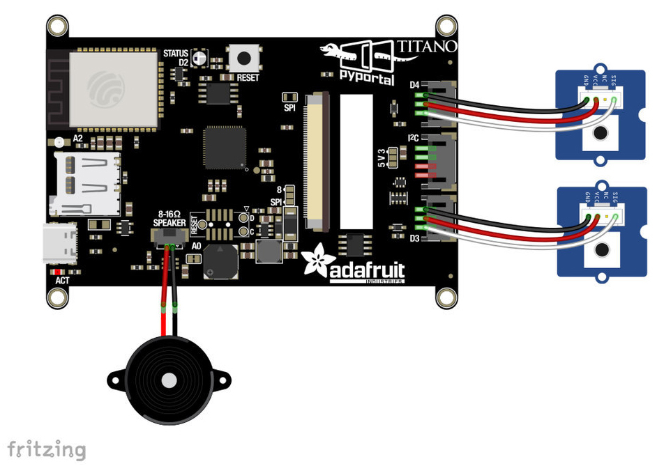

# BlueStamp PyPortal Titano Retro Weather Station 
The PyPortal Titano Retro Weather Station displays the local temperature, weather conditions, time, and date. It also contains a customizable alarm system, with multiple daily and weekly alarms. Packed in a cool 3-D printed case, the Retro Weather Station looks like a small television.

| **Engineer** | **School** | **Area of Interest** | **Grade** |
|:--:|:--:|:--:|:--:|
| Malachi J | Institute for Collabortive Education (ICE) | Civil Engineering | Incoming Senior


  
# Final Milestone

<iframe width="667" height="375" src="https://www.youtube.com/embed/4FySYY1a4lU" title="Malachi J Final Milestone" frameborder="0" allow="accelerometer; autoplay; clipboard-write; encrypted-media; gyroscope; picture-in-picture; web-share" referrerpolicy="strict-origin-when-cross-origin" allowfullscreen></iframe>

For the final milestone I got to finish the modifications for my project including using and making the portals light sensor to instead be auto so that the screen auto dims and brightens. But due to the case that feature is blocked. And the other modification was that I added some custom icons for the pyportal including when it's sunny, raining, cloudy. And to top it off I finished putting together the 3d printed case so that it looks presentable.  


# Second Milestone

<iframe width="667" height="375" src="https://www.youtube.com/embed/N8ZDS43XqOE" title="Malachi JT Milestone 2" frameborder="0" allow="accelerometer; autoplay; clipboard-write; encrypted-media; gyroscope; picture-in-picture; web-share" referrerpolicy="strict-origin-when-cross-origin" allowfullscreen></iframe>

My second milestone I tinkered with my pyportal alot and encontered alot of coding errors while tampering with the pyportal including sd card and icons not reading properly after formatting it for the pyportal. But as of now I finally got the pyportal to load up without the use of the sd card and icons and successfully connect to my home internet without using hotspot since that was also a issue. The portal can now show the weather by taking the api openweather code and website to show the date, time, weather, in my area (New York). The pyportal can now also successfully play alarms from different parts of the day, and also from major holidays. I can use the two buttons on the side to snooze or dismiss the alarm. 


# First Milestone

<iframe width="667" height="375" src="https://www.youtube.com/embed/11ZVHGhcsv8" title="Malachi J Milestone 1" frameborder="0" allow="accelerometer; autoplay; clipboard-write; encrypted-media; gyroscope; picture-in-picture; web-share" referrerpolicy="strict-origin-when-cross-origin" allowfullscreen></iframe>

My first Milestone was mainly developing the code for the Pyportal and had download the main files needed such as the code.py, setting.toml, openweather_graphics.py, and the calender.py. Which were the main files used to help store the necessary code for the project. Some challenges so far is getting anything from the code developed to be shown on the screen for instance the weather background or anything from the code to pop up. The only thing I got to show up was when using the Mu editor for anything to pop up when typing something. And so for next time I plan on figuring out how to get what I have coded to be shown on the Pyportal screen. 


# Schematics 


  

Code.py
```c++

# SPDX-FileCopyrightText: 2020 Liz Clark for Adafruit Industries
# SPDX-License-Identifier: MIT

from os import getenv
import time
from calendar import alarms
from calendar import timers
import board
import displayio
from digitalio import DigitalInOut, Direction, Pull
from adafruit_button import Button
from adafruit_pyportal import PyPortal
import openweather_graphics  # Custom module
import analogio
import os
import microcontroller
import digitalio

# --- Configuration ---
ssid = getenv("CIRCUITPY_WIFI_SSID")
password = getenv("CIRCUITPY_WIFI_PASSWORD")
LOCATION = getenv("location")
OPENWEATHER_TOKEN = getenv("openweather_token")

if None in [ssid, password, LOCATION, OPENWEATHER_TOKEN]:
    raise RuntimeError("Missing WiFi or weather config in settings.toml")

DATA_SOURCE = f"http://api.openweathermap.org/data/2.5/weather?q={LOCATION}&appid={OPENWEATHER_TOKEN}"
DATA_LOCATION = []

# --- Initialize PyPortal ---
pyportal = PyPortal(url=DATA_SOURCE,
                    json_path=DATA_LOCATION,
                    status_neopixel=board.NEOPIXEL,
                    default_bg=0x000000)

display = board.DISPLAY

#--- Light Sensor for Brightness ---
#light_sensor = analogio.AnalogIn(board.A2)
#def get_scaled_brightness():
    #scaled = light_sensor.value / 65535
    #return max(0.1, min(scaled, 1.0))

# --- Setup Weather Graphics ---
gfx = openweather_graphics.OpenWeather_Graphics(pyportal.splash, am_pm=True, celsius=False)

# --- Alarm Assets ---
alarm_sound_trash = "/sounds/trash.wav"
alarm_sound_bed = "/sounds/sleep.wav"
alarm_sound_eat = "/sounds/eat.wav"
alarm_sounds = [alarm_sound_trash, alarm_sound_bed, alarm_sound_eat, alarm_sound_eat, alarm_sound_eat]

bitmap_paths = ["/trashBMP.bmp", "/sleepBMP.bmp", "/eatBMP.bmp"]
alarm_gfx = []

for path in bitmap_paths:
    bmp = displayio.OnDiskBitmap(path)
    tilegrid = displayio.TileGrid(bmp, pixel_shader=bmp.pixel_shader)
    group = displayio.Group()
    group.append(tilegrid)
    alarm_gfx.append(group)

# Duplicate eat gfx to fill 3 meal times
alarm_gfx += [alarm_gfx[2], alarm_gfx[2]]

# --- Buttons ---
snooze_positions = [(4, 222)] * 3
dismiss_positions = [(245, 222)] * 3

snooze_buttons = [Button(x=x, y=y, width=236, height=90, style=Button.RECT, name=f"snooze_{i}")
                  for i, (x, y) in enumerate(snooze_positions)]
dismiss_buttons = [Button(x=x, y=y, width=230, height=90, style=Button.RECT, name=f"dismiss_{i}")
                   for i, (x, y) in enumerate(dismiss_positions)]

for i in range(3):
    alarm_gfx[i].append(snooze_buttons[i].group)
    alarm_gfx[i].append(dismiss_buttons[i].group)

# --- Hardware Buttons (moved off D3/D4) ---
switch_snooze = DigitalInOut(board.D3)  # Left button
switch_snooze.direction = Direction.INPUT
switch_snooze.pull = Pull.UP

switch_dismiss = DigitalInOut(board.D4)  # Right button
switch_dismiss.direction = Direction.INPUT
switch_dismiss.pull = Pull.UP

# --- Alarm Logic ---
weekday = ["Mon.", "Tues.", "Wed.", "Thurs.", "Fri.", "Sat.", "Sun."]
weekly_alarms = [alarms['trash']]
weekly_day = [alarms['trash'][0]]
weekly_time = [alarms['trash'][1]]
alarm_checks = [None, alarms['bed'], alarms['breakfast'], alarms['lunch'], alarms['dinner']]

# --- State Variables ---
localtile_refresh = None
weather_refresh = None
start = None
alarm = False
snoozed = False
dismissed = False
touched = None
phys_dismiss = False
phys_snooze = False
touch_button_snooze = False
touch_button_dismiss = False
mode = 0

# --- Main Loop ---
while True:
        # while esp.is_connected:
    # only query the online time once per hour (and on first run)
    if (not localtile_refresh) or (time.monotonic() - localtile_refresh) > 3600:
        try:
            print("Getting time from internet!")
            pyportal.get_local_time()
            localtile_refresh = time.monotonic()
        except RuntimeError as e:
            print("Some error occured, retrying! -", e)
            continue

    if not alarm:
    # only query the weather every 10 minutes (and on first run)
    #  only updates if an alarm is not active
        if (not weather_refresh) or (time.monotonic() - weather_refresh) > 600:
            try:
                value = pyportal.fetch()
                print("Response is", value)
                gfx.display_weather(value)
                weather_refresh = time.monotonic()
            except RuntimeError as e:
                print("Some error occured, retrying! -", e)
                continue
    #  updates time to check alarms
    #  checks every 30 seconds
    #  identical to def(update_time) in openweather_graphics.py
    if (not start) or (time.monotonic() - start) > 30:
        #  grabs all the time data
        clock = time.localtime()
        date = clock[2]
        hour = clock[3]
        minute = clock[4]
        day = clock[6]
        today = weekday[day]
        format_str = "%d:%02d"
        date_format_str = " %d, %d"
        if hour >= 12:
            hour -= 12
            format_str = format_str+" PM"
        else:
            format_str = format_str+" AM"
        if hour == 0:
            hour = 12
        #  formats date display
        today_str = today
        time_str = format_str % (hour, minute)
        #  checks for weekly alarms
        for i in weekly_alarms:
            w = weekly_alarms.index(i)
            if time_str == weekly_time[w] and today == weekly_day[w]:
                print("trash time")
                alarm = True
                if alarm and not dismissed and not snoozed:
                    display.root_group = alarm_gfx[w]
                    pyportal.play_file(alarm_sounds[w])
                mode = w
                print("mode is:", mode)
        #  checks for daily alarms
        for i in alarm_checks:
            a = alarm_checks.index(i)
            if time_str == alarm_checks[a]:
                alarm = True
                if alarm and not dismissed and not snoozed:
                    display.root_group = alarm_gfx[a]
                    pyportal.play_file(alarm_sounds[a])
                mode = a
                print(mode)
        #  calls update_time() from openweather_graphics to update
        #  clock display
        #board.DISPLAY.brightness = get_scaled_brightness()
        gfx.update_time()
        gfx.update_date()
        start = time.monotonic()

    #  allows for the touchscreen buttons to work
    if mode > 1:
        button_mode = 2
    else:
        button_mode = mode
        #  print("button mode is", button_mode)

    #  hardware snooze/dismiss button setup
    if switch_dismiss.value and phys_dismiss:
        phys_dismiss = False
    if switch_snooze.value and phys_snooze:
        phys_snooze = False
    if not switch_dismiss.value and not phys_dismiss:
        phys_dismiss = True
        print("pressed dismiss button")
        dismissed = True
        alarm = False
        display.root_group = pyportal.splash
        touched = time.monotonic()
        mode = mode
    if not switch_snooze.value and not phys_snooze:
        phys_snooze = True
        print("pressed snooze button")
        display.root_group = pyportal.splash
        snoozed = True
        alarm = False
        touched = time.monotonic()
        mode = mode

    #  touchscreen button setup
    touch = pyportal.touchscreen.touch_point
    if not touch and touch_button_snooze:
        touch_button_snooze = False
    if not touch and touch_button_dismiss:
        touch_button_dismiss = False
    if touch:
        if snooze_buttons[button_mode].contains(touch) and not touch_button_snooze:
            print("Touched snooze")
            display.root_group = pyportal.splash
            touch_button_snooze = True
            snoozed = True
            alarm = False
            touched = time.monotonic()
            mode = mode
        if dismiss_buttons[button_mode].contains(touch) and not touch_button_dismiss:
            print("Touched dismiss")
            dismissed = True
            alarm = False
            display.root_group = pyportal.splash
            touch_button_dismiss = True
            touched = time.monotonic()
            mode = mode

    #  this is a little delay so that the dismissed state
    #  doesn't collide with the alarm if it's dismissed
    #  during the same time that the alarm activates
    if (not touched) or (time.monotonic() - touched) > 70:
        dismissed = False
    #  snooze portion
    #  pulls snooze_time from calendar and then when it's up
    #  splashes the snoozed alarm's graphic, plays the alarm sound and goes back into
    #  alarm state
    if (snoozed) and (time.monotonic() - touched) > timers['snooze_time']:
        print("snooze over")
        snoozed = False
        alarm = True
        mode = mode
        display.root_group = alarm_gfx[mode]
        pyportal.play_file(alarm_sounds[mode])
        print(mode)
```
Opeanweather_Graphics.py

```
# SPDX-FileCopyrightText: 2019 Limor Fried for Adafruit Industries
# SPDX-FileCopyrightText: 2020 Liz Clark for Adafruit Industries
#
# SPDX-License-Identifier: MIT

import time
import json
from calendar import holidays
import displayio
from adafruit_display_text.label import Label
from adafruit_bitmap_font import bitmap_font

cwd = ("/"+__file__).rsplit('/', 1)[0] # the current working directory (where this file is)

small_font = cwd+"/fonts/EffectsEighty-24.bdf"
medium_font = cwd+"/fonts/EffectsEighty-32.bdf"
weather_font = cwd+"/fonts/EffectsEighty-48.bdf"
large_font = cwd+"/fonts/EffectsEightyBold-68.bdf"

month_name = ["Jan.", "Feb.", "Mar.", "Apr.", "May", "June", "July", "Aug.",
              "Sept.", "Oct.", "Nov.", "Dec."]
weekday = ["Mon.", "Tues.", "Wed.", "Thurs.", "Fri.", "Sat.", "Sun."]
holiday_checks = [holidays['new years'][0],holidays['valentines'][0],
                  holidays['halloween'][0],holidays['xmas'][0]]
holiday_greetings = [holidays['new years'][1],holidays['valentines'][1],
                     holidays['halloween'][1],holidays['xmas'][1]]

class OpenWeather_Graphics(displayio.Group):

    def __init__(self, root_group, *, am_pm=True, celsius=True):
        super().__init__()
        self.am_pm = am_pm
        self.celsius = celsius

        root_group.append(self)
        self._icon_group = displayio.Group()
        self.append(self._icon_group)
        self._text_group = displayio.Group()
        self.append(self._text_group)

        self._icon_sprite = None
        self._icon_file = None
        self.set_icon(cwd+"/weather_background.bmp")

        self.small_font = bitmap_font.load_font(small_font)
        self.medium_font = bitmap_font.load_font(medium_font)
        self.weather_font = bitmap_font.load_font(weather_font)
        self.large_font = bitmap_font.load_font(large_font)
        glyphs = b'0123456789abcdefghijklmnopqrstuvwxyzABCDEFGHIJKLMNOPQRSTUVWXYZ-,.: '
        self.small_font.load_glyphs(glyphs)
        self.medium_font.load_glyphs(glyphs)
        self.weather_font.load_glyphs(glyphs)
        self.large_font.load_glyphs(glyphs)
        self.large_font.load_glyphs(('°',))  # a non-ascii character we need for sure
        self.city_text = None
        self.holiday_text = None

        self.time_text = Label(self.medium_font)
        self.time_text.x = 365
        self.time_text.y = 15
        self.time_text.color = 0x5AF78E
        self._text_group.append(self.time_text)

        self.date_text = Label(self.medium_font)
        self.date_text.x = 10
        self.date_text.y = 15
        self.date_text.color = 0x57C6FE
        self._text_group.append(self.date_text)

        self.temp_text = Label(self.large_font)
        self.temp_text.x = 316
        self.temp_text.y = 165
        self.temp_text.color = 0xFF6AC1
        self._text_group.append(self.temp_text)

        self.main_text = Label(self.weather_font)
        self.main_text.x = 10
        self.main_text.y = 258
        self.main_text.color = 0x99ECFD
        self._text_group.append(self.main_text)

        self.description_text = Label(self.small_font)
        self.description_text.x = 10
        self.description_text.y = 296
        self.description_text.color = 0x9FA0A2
        self._text_group.append(self.description_text)

    def display_weather(self, weather):
        weather = json.loads(weather)

        # set the icon/background
        weather_icon = weather['weather'][0]['icon']
        self.set_icon("/sd/icons/"+weather_icon+".bmp")

        city_name =  weather['name'] + ", " + weather['sys']['country']
        print(city_name)
        if not self.city_text:
            self.city_text = Label(self.medium_font, text=city_name)
            self.city_text.x = 300
            self.city_text.y = 296
            self.city_text.color = 0xCF5349
            self._text_group.append(self.city_text)

        self.update_time()

        main_text = weather['weather'][0]['main']
        print(main_text)
        self.main_text.text = main_text

        temperature = weather['main']['temp'] - 273.15 # its...in kelvin
        print(temperature)
        if self.celsius:
            self.temp_text.text = "%d °C" % temperature
        else:
            self.temp_text.text = "%d °F" % ((temperature * 9 / 5) + 32)

        description = weather['weather'][0]['description']
        description = description[0].upper() + description[1:]
        print(description)
        self.description_text.text = description
        # "thunderstorm with heavy drizzle"

    def update_time(self):
        """Fetch the time.localtime(), parse it out and update the display text"""
        now = time.localtime()
        hour = now[3]
        minute = now[4]
        format_str = "%d:%02d"
        if self.am_pm:
            if hour >= 12:
                hour -= 12
                format_str = format_str+" PM"
            else:
                format_str = format_str+" AM"
            if hour == 0:
                hour = 12
        time_str = format_str % (hour, minute)
        print(time_str)
        self.time_text.text = time_str

    def update_date(self):
        date_now = time.localtime()
        year = date_now[0]
        mon = date_now[1]
        date = date_now[2]
        day = date_now[6]
        today = weekday[day]
        month = month_name[mon - 1]
        date_format_str = " %d, %d"
        shortened_date_format_str = " %d"
        date_str = today+", "+month+date_format_str % (date, year)
        holiday_date_str = month+shortened_date_format_str % (date)
        print(date_str)
        self.date_text.text = date_str
        for i in holiday_checks:
            h = holiday_checks.index(i)
            if holiday_date_str == holiday_checks[h]:
                if not self.holiday_text:
                    self.holiday_text = Label(self.medium_font)
                    self.holiday_text.x = 10
                    self.holiday_text.y = 45
                    self.holiday_text.color = 0xf2f89d
                    self._text_group.append(self.holiday_text)
                self.holiday_text.text = holiday_greetings[h]

    def set_icon(self, filename):
        """The background image to a bitmap file.

        :param filename: The filename of the chosen icon

        """
        print("Set icon to ", filename)
        if self._icon_group:
            self._icon_group.pop()

        if not filename:
            return  # we're done, no icon desired
        if self._icon_file:
            self._icon_file.close()

        icon = displayio.OnDiskBitmap(filename)
        self._icon_sprite = displayio.TileGrid(icon, pixel_shader=icon.pixel_shader)

        self._icon_group.append(self._icon_sprite)
```
Calender.py
```
# SPDX-FileCopyrightText: 2020 Liz Clark for Adafruit Industries
#
# SPDX-License-Identifier: MIT

alarms = {
    'bed' : '12:00 PM',
    'breakfast' : '8:00 AM',
    'lunch' : '12:00 PM',
    'dinner' : '9:30 PM',
    'trash' : ('Fri.', '1:00 PM')
    }

timers = {
    'snooze_time' : 300
    }

holidays = {
    'new years' : ('Jan. 1', 'Happy New Year!'),
    'valentines' : ('Feb. 14', "Happy Valentine's Day! <3"),
    'halloween' : ('Oct. 31', 'Happy Halloween!'),
    'xmas' : ('Dec. 25', 'Merry Christmas!')
    }
```

Bill of Materials

| **Part** | **Note** | **Price** | **Link** |
|:--:|:--:|:--:|:--:|
| Adafruit PyPortal Titano |The device on which the entire project is run | $59.95 | <a href="https:https://www.adafruit.com/product/4444"> Link </a> |
| STEMMA Wired Tactile Push-Button Pack - 5 Color Pack | Used for the dismiss/snooze commands on the alarms | $7.50 | <a href="https:https://www.adafruit.com/product/4431"> Link </a> |
| Mini Oval Speaker - 8 Ohm 1 Watt | Plays sounds that come from the device, connected directly to the PyPortal Titano | $1.95 | <a href="https:https://www.adafruit.com/product/3923"> Link </a> |
| Black Nylon Machine Screw and Stand-off Set – M2.5 Thread | Used to secure the 3-D printed case onto the PyPortal screen | $16.95 | <a href="https:https://www.adafruit.com/product/3299"> Link </a> |
| 5V 1A (1000mA) USB port power supply - UL Listed | Used to connect the PyPortal to a wall electrical outlet | $5.95 | <a href="https:https://www.adafruit.com/product/501"> Link </a> |
| USB Type A to Type C Cable - approx 1 meter / 3 ft long | Used to connect PyPortal Titano to either a computer or other power source. When connected to a computer, the USB cable is used to save code from the computer and update the project screen. When used to plug into a wall electrical outlet, the cable works to supply power to the device.| $4.95 | <a href="https:https://www.adafruit.com/product/4474"> Link </a> |
| 8GB micro SD Card | Used to store high-storage files which the PyPortal Titano does not have the storage to store in itself | $9.95 | <a href="https:https://www.adafruit.com/product/2692"> Link </a> |

# Other Resources/Examples

- [Adafruit Pyportal Overview](https://learn.adafruit.com/pyportal-weather-station/overview)
