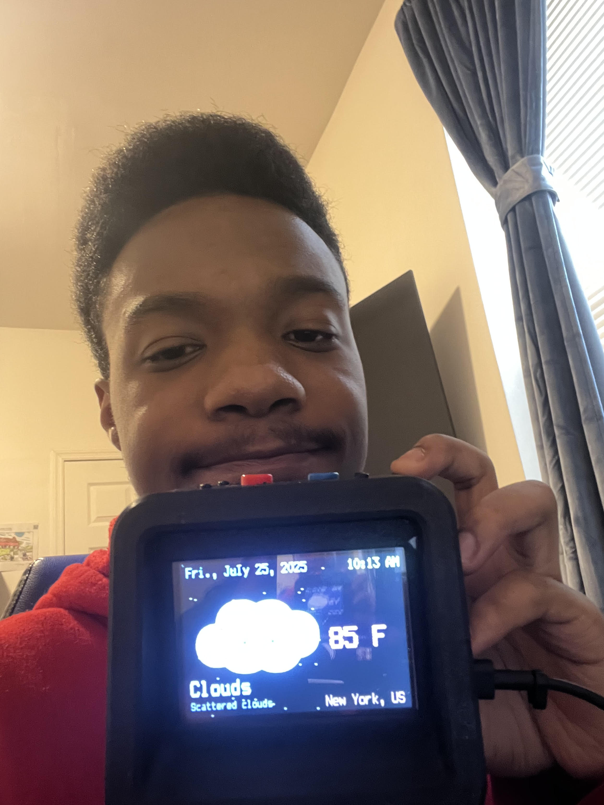

# BlueStamp PyPortal Titano Retro Weather Station 
The PyPortal Titano Retro Weather Station displays the local temperature, weather conditions, time, and date. It also contains a customizable alarm system, with multiple daily and weekly alarms. Packed in a cool 3-D printed case, the Retro Weather Station looks like a small television.

You should comment out all portions of your portfolio that you have not completed yet, as well as any instructions:
```HTML 
<!--- This is an HTML comment in Markdown -->
<!--- Anything between these symbols will not render on the published site -->
```

| **Engineer** | **School** | **Area of Interest** | **Grade** |
|:--:|:--:|:--:|:--:|
| Malachi J | Institute for Collabortive Education (ICE) | Civil Engineering | Incoming Senior

**Replace the BlueStamp logo below with an image of yourself and your completed project. Follow the guide [here](https://tomcam.github.io/least-github-pages/adding-images-github-pages-site.html) if you need help.**


  
# Final Milestone

**Don't forget to replace the text below with the embedding for your milestone video. Go to Youtube, click Share -> Embed, and copy and paste the code to replace what's below.**

<iframe width="560" height="315" src="https://www.youtube.com/embed/F7M7imOVGug" title="YouTube video player" frameborder="0" allow="accelerometer; autoplay; clipboard-write; encrypted-media; gyroscope; picture-in-picture; web-share" allowfullscreen></iframe>

For the final milestone I got to finish the modifications for my project including using and making the portals light sensor to instead be auto so that the screen auto dims and brightens. But due to the case that feature is blocked. And the other modification was that I added some custom icons for the pyportal including when it's sunny, raining, cloudy. And to top it off I finished putting together the 3d printed case so that it looks presentable.  


# Second Milestone

**Don't forget to replace the text below with the embedding for your milestone video. Go to Youtube, click Share -> Embed, and copy and paste the code to replace what's below.**

<iframe width="667" height="375" src="https://www.youtube.com/embed/N8ZDS43XqOE" title="Malachi JT Milestone 2" frameborder="0" allow="accelerometer; autoplay; clipboard-write; encrypted-media; gyroscope; picture-in-picture; web-share" referrerpolicy="strict-origin-when-cross-origin" allowfullscreen></iframe>

My second milestone I tinkered with my pyportal alot and encontered alot of coding errors while tampering with the pyportal including sd card and icons not reading properly after formatting it for the pyportal. But as of now I finally got the pyportal to load up without the use of the sd card and icons and successfully connect to my home internet without using hotspot since that was also a issue. The portal can now show the weather by taking the api openweather code and website to show the date, time, weather, in my area (New York). The pyportal can now also successfully play alarms from different parts of the day, and also from major holidays. I can use the two buttons on the side to snooze or dismiss the alarm. 


# First Milestone

<iframe width="667" height="375" src="https://www.youtube.com/embed/11ZVHGhcsv8" title="Malachi J Milestone 1" frameborder="0" allow="accelerometer; autoplay; clipboard-write; encrypted-media; gyroscope; picture-in-picture; web-share" referrerpolicy="strict-origin-when-cross-origin" allowfullscreen></iframe>

My first Milestone was mainly developing the code for the Pyportal and had download the main files needed such as the code.py, setting.toml, openweather_graphics.py, and the calender.py. Which were the main files used to help store the necessary code for the project. Some challenges so far is getting anything from the code developed to be shown on the screen for instance the weather background or anything from the code to pop up. The only thing I got to show up was when using the Mu editor for anything to pop up when typing something. And so for next time I plan on figuring out how to get what I have coded to be shown on the Pyportal screen. 


# Schematics 
Here's where you'll put images of your schematics. [Tinkercad](https://www.tinkercad.com/blog/official-guide-to-tinkercad-circuits) and [Fritzing](https://fritzing.org/learning/) are both great resoruces to create professional schematic diagrams, though BSE recommends Tinkercad becuase it can be done easily and for free in the browser. 

# Code
Here's where you'll put your code. The syntax below places it into a block of code. Follow the guide [here]([url](https://www.markdownguide.org/extended-syntax/)) to learn how to customize it to your project needs. 

```c++
void setup() {
  // put your setup code here, to run once:
  Serial.begin(9600);
  Serial.println("Hello World!");
}

void loop() {
  // put your main code here, to run repeatedly:

}
```

# Bill of Materials
Here's where you'll list the parts in your project. To add more rows, just copy and paste the example rows below.
Don't forget to place the link of where to buy each component inside the quotation marks in the corresponding row after href =. Follow the guide [here]([url](https://www.markdownguide.org/extended-syntax/)) to learn how to customize this to your project needs. 

| **Part** | **Note** | **Price** | **Link** |
|:--:|:--:|:--:|:--:|
| Item Name | What the item is used for | $Price | <a href="https://www.amazon.com/Arduino-A000066-ARDUINO-UNO-R3/dp/B008GRTSV6/"> Link </a> |
| Item Name | What the item is used for | $Price | <a href="https://www.amazon.com/Arduino-A000066-ARDUINO-UNO-R3/dp/B008GRTSV6/"> Link </a> |
| Item Name | What the item is used for | $Price | <a href="https://www.amazon.com/Arduino-A000066-ARDUINO-UNO-R3/dp/B008GRTSV6/"> Link </a> |

# Other Resources/Examples
One of the best parts about Github is that you can view how other people set up their own work. Here are some past BSE portfolios that are awesome examples. You can view how they set up their portfolio, and you can view their index.md files to understand how they implemented different portfolio components.
- [Example 1](https://trashytuber.github.io/YimingJiaBlueStamp/)
- [Example 2](https://sviatil0.github.io/Sviatoslav_BSE/)
- [Example 3](https://arneshkumar.github.io/arneshbluestamp/)

To watch the BSE tutorial on how to create a portfolio, click here.
